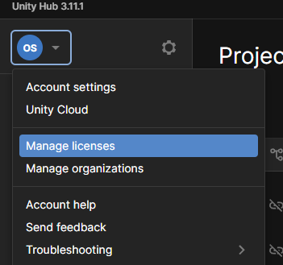
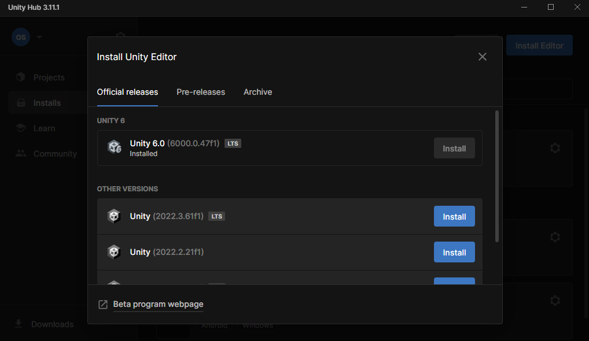
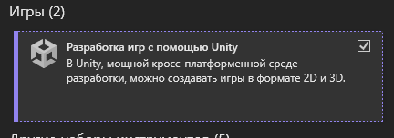

# Установка необходимых программ

Мы будем работать в Unity версии 6.

Писать код будем в Visual Studio Community 2022. Для слабых ПК (мало ОЗУ), можно писать в Visual Studio Code.

Для контроля версий будем использовать GitHub, все манипуляции в GitHub Desktop.

## Установка Unity + VS Studio

1) Переходим на сайт [Unity](https://unity.com/download) и кликаем `Download for Windows` (если у вас другая ОС, срочно пишите мне!!!)

2) Скачиваете UnityHub и запускаете. Вас попросят войти в аккаунт Unity. Заходим или быстренько регистрируемся, там процедура несложная.

3) После входа в аккаунт, проверьте наличие лицензии. Делается это здесь:

Проверьте, что у вас есть лицензия `PE Personal`. Если нет, тыкните на получении лицензии, это в два клика *(хватай пока бесплатно!)*

4) Заходим во вкладку `Installs` и тыкаем по синей кнопке `Install Editor`. Нажимаем на `Install`. (На скрине у меня кнопка серая)

5) Выбираем, что устанавливать. Если у вас ПК более-менее (не прошлого века), то устанавливаем галочку возле Microsoft Visual Studio Community 2022. Больше ничего не тыкаем.

!!! note ""
	Если у вас уже был Visual Studio, читаем [Настройка Visual Studio](installation.md#visual-studio)

6) После установки почти все готово. На всякий случай читаем [Собираем солянку](installation.md#_2)

## Настройка Visual Studio

Если вы до Unity устанавливали Visual Studio, то его нужно настроить, ибо UnityHub автоматически не добавляет расширение, а только смотрит наличие самого VS.

1) Заходим в Visual Studio. Выбираем `Продолжить без кода`.

2) Находим сверху вкладку `Средства`. В ней тыкаем по `Получить средства и компоненты`.

3) В открывшемся списке листаем до компонента `Разработка игр с помощью Unity`. Устанавливаем галочку и кликаем справа в углу на `Изменить`.

## Visual Studio Code

Итак, давайте сразу проясним, что с VS Code:

- Он крайне легкий, и запускается за пару секунд.
- Без расширения это чистый текстовый редактор, не IDE.
- Возможности дебаггинга сильно ограничены
- В VS есть продвинутый Intellisense, который при написании кода не только подсказывает огромное количество всего, но и иногда предлагает куски кода. В VS Code такого нет.

Если вы любитель легкости, хардкорщик или вы уже продвинутый пользователь VS Code (установлено 30+ расширений, в том числе аниме-обои, звуки пердежа при нахождении анализатором ошибок и другие *безусловно* интересные штуки), или все же у вас не так много оперативы, то, как говорится, *welcome*.

1) Заходим на сайт [VS Code](https://code.visualstudio.com/) и скачиваем и устанавливаем его.

2) Заходим в расширения (слева на панели значок квадратиков) и в поиске вбиваем `unity`. Находим и устанавливаем расширение `Unity` (от Microsoft).

## Собираем солянку

Итак, мы установили IDE или редактор, а также Unity. Чтобы совсем все было прекрасно, нужно проверить, что они знают друг о друге.

1) Для этого нужно создать проект, или открыть уже существующий.

2) В Unity ищем сверху вкладку `Edit`, тыкаем по `Preferences`.

3) В окошке находим вкладку `External Tools`. Самый первый пункт - `External Script Editor`. В нем должен быть выставлен `Visual Studio` или `Visual Studio Code`. Если выставлен `Open by file extension`, выбираем нам подходящее.

!!! note ""
	Если я найду смельчака, который будет писать код в Vim, или neoVim, он получит достижение "Vim clown".

## Git и GitHub Desktop

Эту часть дополню позже.