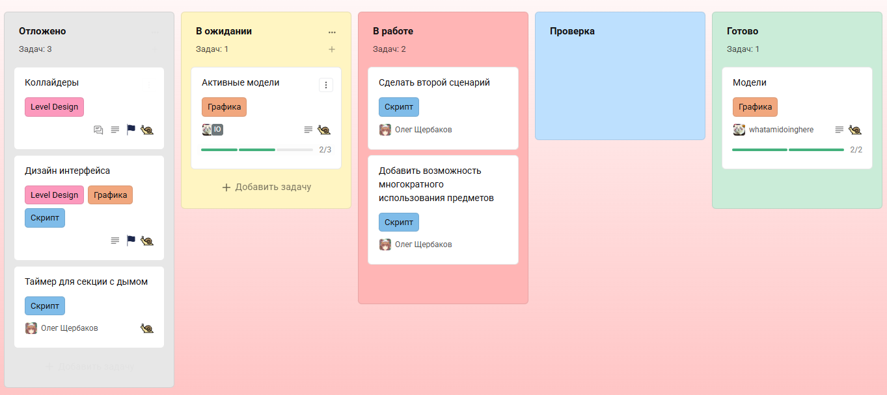
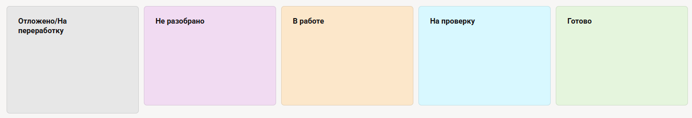
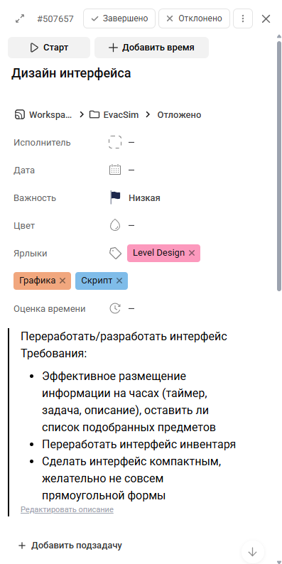
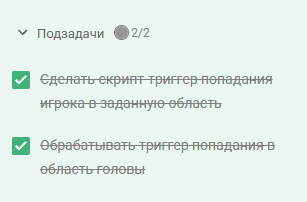

# Работа со Strive

Ссылка на проект в [Strive](https://app.striveapp.ru/join/0a00285e-e23b-469b-8b4f-051b1b97bba2).

При регистрации постарайтесь, чтобы ваш логин/отображаемое имя помогали понять, что это именно **вы**.

## Что такое Strive?

Для отслеживания задач, которыми вы заняты, мы будем пользоваться сервисом **Strive**.

Этот сервис предоставляет удобную работу с канбан доской. Эта виртуальная доска разделена на колонки, в каждой из которых находятся определенные задачи. Чтобы было яснее, вот пример канбан доски моего проекта:

У каждой задачи есть название, описание, чек-лист этапов (в примере это 2/3 и 2/2 у задач), ярлыки (Level Design, Скрипт, Графика) и исполнители задач.

Вот так будет выглядеть **наша** доска:

Давайте разберем, какие колонки за что отвечают, чтобы точно не было недопониманий:

- **Отложено/На переработку** - те задачи, выполнение которых сейчас не актуально, либо идея, которая лежит в основе задачи, требует значительной переработки со стороны геймдизайна.
- **Не разобрано** - задачи, которые еще никто не взял.
- **В работе** - задачи, которые находятся в процессе выполнения, и у них есть исполнитель\исполнители.
- **На проверку** - задачи, результат которых уже в ожидании принятия pull request'a.
- **Готово** - здесь будут задачи, факт выполнения которых крайне важен, и список чек-листов которых может быть дополнен в будущем.

Не думаю, что по колонкам есть вопросы, кроме, наверное, последней. Давайте поясню:

После того, как задача принята, то я обычно нажимаю у задачи сверху кнопку `Завершено`. Это убирает задачу с доски совсем. Поэтому в основном колонка **Готово** будет пустовать.

## Работа с задачами

После того, как Капитан включится в работу, он начнет создавать задачи. Давайте покажу, как это делается.

У каждой колонки снизу есть кнопка `Создать задачу`. Появляется текстовое поле для названия задачи. После нажатия Enter задача появляется.

Каждая задача будет выглядеть следующим образом:

Пару правил:

1. Если вы работаете с задачей, вы можете перемещать ее только в колонку `В работе` и `На проверку`. Остальные колонки предоставлены Капитану и мне.
2. Не завершайте задачу сами. Вы ее просто уберете. Я сделаю это за вас, если посчитаю нужным.

Я не думаю, что возникнут какие-то проблемы с пониманием того, что здесь что. Так что давайте просто коротко про рекомендации:

1. Сначала определитесь с тем, кто будет распределять задачи. У вас два варианта: либо это делает за вас Капитан, и вы постфактум работаете с тем, что сказано, либо вы разбираете те задачи, которые вам нравятся, или вы сможете потянуть. Решите это сами между собой.
2. Добавьте ярлыки по типу того, что есть у меня в примерах. Они позволят сразу видеть, кто с чем работает, и к кому обращаться в случае чего. Не ограничивайтесь только тем, что у меня в примере, сделайте, например разделение по необходимым навыкам кодинга, или что-то другое. Весь ваш креатив у вас в руках.
3. Добавляйте в описание еще и требования к задаче. У меня в команде всего три человека, и мне бессмысленно для самого себя писать, как должен работать скрипт. У меня это видно в архитектуре. А вот для вас важно.
4. Не добавляйте слишком крупные задачи. Большие задачи вы в рот не запихнете. Разбейте на маленькие задачи. Например, вместо "сделать передвижение игрока" - две задачи "перемещение на WASD" и "dash игрока". Еще круче, если вы будете делить задачи на подзадачи, чтобы и вы чувствовали прогресс, и другие видели состояние работы. (см. пример)

В остальном, думаю, все понятно. Если будут вопросы, пишите.