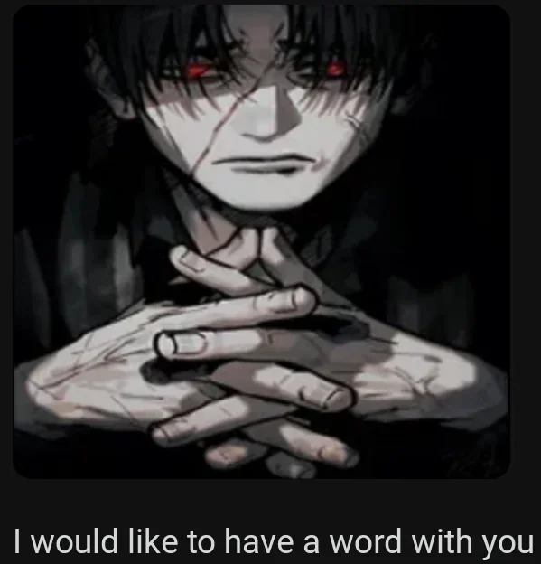

# Spark GameDev Wiki

Добро пожаловать на вики по нашему направлению!

Здесь вы найдете практически все, что касается нашей работы, включая материалы для изучения и задачи.

## Ментор

**Щербаков Олег** - УГНТУ, БПОи-21-03, 4-й курс.

**Связь:** [Телеграмм](https://t.me/FrostHoll), [VK](https://vk.com/olezhafrostholl)

Пишите в любое время дня и ночи. Только не задавайте тупых вопросов. (см. [FAQ](rules/faq.md))

## Команда

Наша команда - [**Буханочки**](team/team_index.md).

[**Встречи**](team/meetings.md)

[**Доска почета**](team/hall_of_fame.md)

## Мем дня

## Обновления

**28.04** - Обновлена ссылка на Strive. Добавлена страница с [доской почета](team/hall_of_fame.md).

**24.04** - Добавлена страница про [Strive](guides/strive.md) и материал для знакомства с [Unity](learn/lvl_1/1_2_unity_start.md).

**22.04** - Добавлена страница с [MVP](project/mvp_reqs.md) и текущими задачами.

**20.04** - Добавлена страничка со [встречами](team/meetings.md), добавлена поддержка стилей для кода.

**19.04** - Добавлен гайд на работу с [Git](guides/git.md), [материал](learn/lvl_2/OOP_base.md) по Базе ООП на 2-м уровне.

**18.04** - Запущена Wiki.