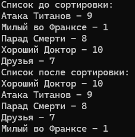

# 1.1 Сортировка сериалов

Перед выполнением вы должны знать: основы C#, Классы, Объекты, Циклы.

!!! note "Задача:"
	Написать программу, которая запросит данные об просмотренных сериалах и их оценках, затем выведет отсортированный список по рейтингу.

Итак, сначала создадим проект. В настройках выберите пункт `Не использовать операторы верхнего уровня`, чтобы вы не расслаблялись там.

Наш код выглядит следующим образом:

```csharp
namespace <...>
{
    internal class Program
    {
        static void Main(string[] args)
        {
            Console.WriteLine("Hello, World!");
        }
    }
}
```

## Описание класса модели

Давайте начнем с определения, что нам нужно. Нам нужно хранить сериалы. У сериала есть:

- Название
- Рейтинг

Это **модель**. Она должна располагаться на доменном уровне приложения... ай ладно, давайте не погружаться глубоко в это пока.

Напишем класс сериала ниже класса `Program` (внутри namespace!).

Назовем его `TVShow`:

```csharp
class TVShow
{

}
```

Пока он у нас пустой, давайте сделаем поля, которые мы выделили.

- `name` - название сериала. Строка, поэтому `string`.
- `rating` - рейтинг сериала. Тип зависит от шкалы рейтинга. Давайте условимся, что рейтинг у нас целочисленный от 1 до 10. Выбираем `int`.

Нам бы не хотелось, чтобы кто-то изменял данные извне, после того как мы их ввели (см. принцип сокрытия), поэтому делаем их закрытыми.

```csharp
class TVShow
{
    private string _name;

    private int _rating;
}
```

Нижнее подчеркивание в названии переменной - стиль написания кода в C#. Оно добавляется ко **всем** закрытым полям класса.

Как-то мы же должны их заполнять, верно? Мы будем заполнять их при создании объекта, передавая все в конструктор:

```csharp
public TVShow(string name, int rating)
{
    _name = name;
    _rating = rating;
}
```

В качестве параметров мы передаем название и рейтинг и устанавливаем значения в соответствующие поля.

Но нам все же нужна возможность **читать** значения извне. Сделаем **свойства**:

```csharp
public string Name => _name;

public int Rating => _rating;
```

Так мы обеспечиваем возможность получения значений через `.Name` и `.Rating`, а менять их не можем.

Итоговая модель такая:

```csharp
class TVShow
{
    private string _name;

    private int _rating;

    public string Name => _name;

    public int Rating => _rating;

    public TVShow(string name, int rating)
    {
        _name = name;
        _rating = rating;
    }
}
```

## Списки и заполнение данных

Вернемся в класс Program. Убираем все из метода Main.

Создаем список наших будущих сериалов. Объявим и инициализируем переменную `tvshows`:

```csharp
static void Main(string[] args)
{
    var tvShows = new List<TVShow>();
}
```

`List<T>` - это обычный динамический список, подключаемый пространством имен `System.Collections.Generic`. Это шаблонный класс, поэтому в треугольных скобочках указываем тип объектов, которые будут храниться внутри списка.

`var` - ключевое слово, используемое при объявлении переменной, когда она явно инициализирована с другой стороны. Используем, если после знака равно четко виден или известен тип переменной.

> Аналогичная инициализация без var: `List<TVShow> tvShows = new List<TVShow>();`

Теперь давайте спрашивать у пользователя, сколько сериалов в базе и сделаем по количеству цикл `for`. Внутри будем заносить в локальные переменные название и рейтинг каждого сериала.

```csharp
Console.WriteLine("Укажите количество сериалов в базе:");
var count = Convert.ToInt32(Console.ReadLine()); //преобразуем string в int
for (int i = 0; i < count; i++)
{
    Console.WriteLine($"{i + 1}: \nНазвание:");
    string name = Console.ReadLine() ?? ""; //если из консоли прилетело null, заменяем его на пустую строку
    Console.WriteLine("Рейтинг:");
    int rating = Convert.ToInt32(Console.ReadLine());

}
```

На каждой итерации цикла создаем новый объект `TVShow` и передаем в конструктор полученные данные. Заносим их в список.

```csharp
var tvShow = new TVShow(name, rating);
tvShows.Add(tvShow);
```

Можем дополнительно после цикла вывести весь список. Воспользуемся конструкцией foreach:

```csharp
foreach (var tvShow in tvShows)
{
    Console.WriteLine($"{tvShow.Name} - {tvShow.Rating}");
}
```

## Сортировка

Теперь нам нужно отсортировать список. Я бы чувствовал сейчас себя странно, если бы вам на практике показал реализацию, например **метода пузырька** или **QuickSort**. Это было бы смешно. Все таки такую базу вы можете найти и сами. Мы же с вами тут продвинутые ребята, верно?

Воспользуемся встроенным методом сортировки у списков и массивов. Он под капотом использует либо **сортировку вставками**, либо **HeapSort** либо **QuickSort** в зависимости от размера списка.

!!! note "Важно!"
	Если мы своими ручками не делаем сортировку, это не значит, что мы не знаем, как она работает. Буду спрашивать!

Итак, сортировка выглядит следующим образом:

```csharp
tvShows.Sort((a, b) => a.Rating - b.Rating);
```

И че это такое? Давайте разбираться.

В аргументы метода `.Sort()` мы передаем **компаратор**. Функция, которая будет знать, какой из любых двух элементов больше.

Она должна выводить целое число. Причем:

- Отрицательное число, если первый элемент меньше второго.
- 0, если они равны.
- Положительное, если второй элемент больше первого.

Внутри у нас находится такая конструкция: `(a, b) => a.Rating - b.Rating`

Это **лямбда выражение**, или по-простому анонимная функция. У нее нет названия, поэтому анонимная. Она будет применяться к каждой паре элементов.

В скобках `a` и `b` - два элемента для сравнения из списка. Имя переменных можно выбрать любое. Далее идет значок `=>`, что показывает, что это именно лямбда.

После стрелочки идет логика функции. Если она только возвращает значение, то можно опускать `return`. Если строк несколько, то вся логика описывается в фигурных скобках, и `return` уже обязателен.

Так вот. Это функция, которая берет попарно каждые два элемента и считает между ними разницу рейтинга. И, **если разница получилась положительной**, то **элементы меняются местами**.

Догадались? Да, в таком виде сортировка произойдет по возрастанию, что нам не особо нужно. Для этого... поменяем `a` и `b` местами!

И, собственно, все. Итоговый код в Program выглядит так:

```csharp
static void Main(string[] args)
{
    var tvShows = new List<TVShow>();

    Console.WriteLine("Укажите количество сериалов в базе:");
    var count = Convert.ToInt32(Console.ReadLine());
    for (int i = 0; i < count; i++)
    {
        Console.WriteLine($"{i + 1}: \nНазвание:");
        string name = Console.ReadLine() ?? "";
        Console.WriteLine("Рейтинг:");
        int rating = Convert.ToInt32(Console.ReadLine());

        var tvShow = new TVShow(name, rating);
        tvShows.Add(tvShow);
    }

    Console.WriteLine("Список до сортировки:");
    foreach (var tvShow in tvShows)
    {
        Console.WriteLine($"{tvShow.Name} - {tvShow.Rating}");
    }

    tvShows.Sort((a, b) => b.Rating - a.Rating);

    Console.WriteLine("Список после сортировки:");
    foreach (var tvShow in tvShows)
    {
        Console.WriteLine($"{tvShow.Name} - {tvShow.Rating}");
    }
}
```

И пример вывода:



## Задание

Теперь добавьте модели сериала поле **Жанр**. Перед сортировкой спросите желаемый жанр, и выведите только топ-3 сериалов в этом жанре по рейтингу.