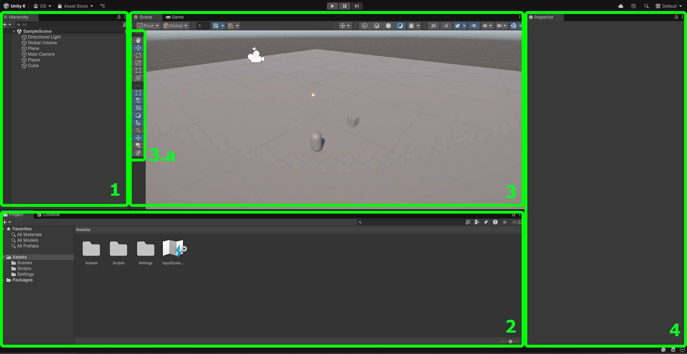
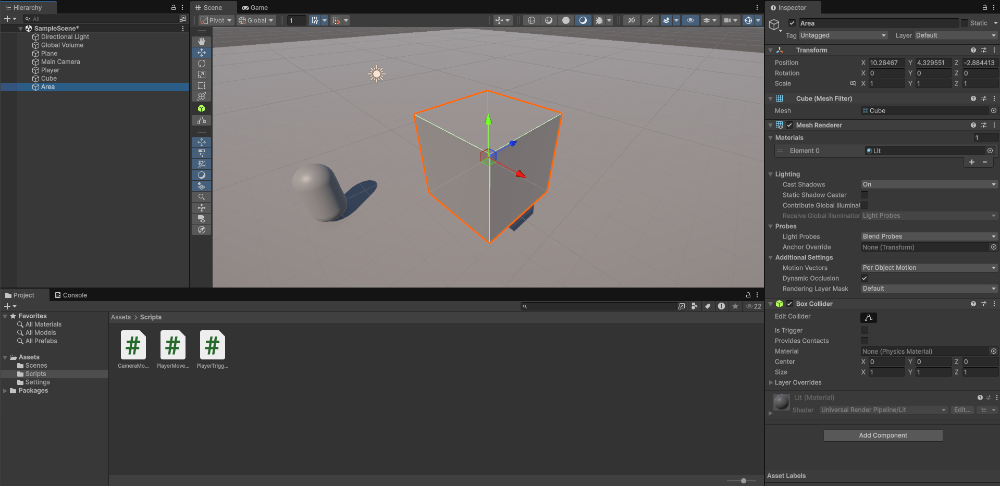
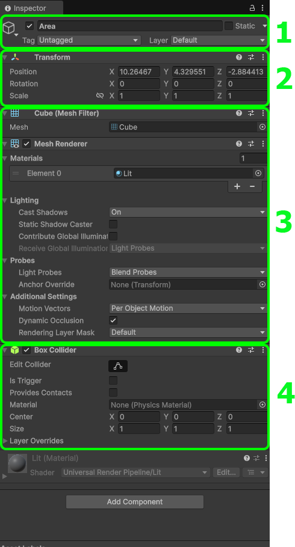
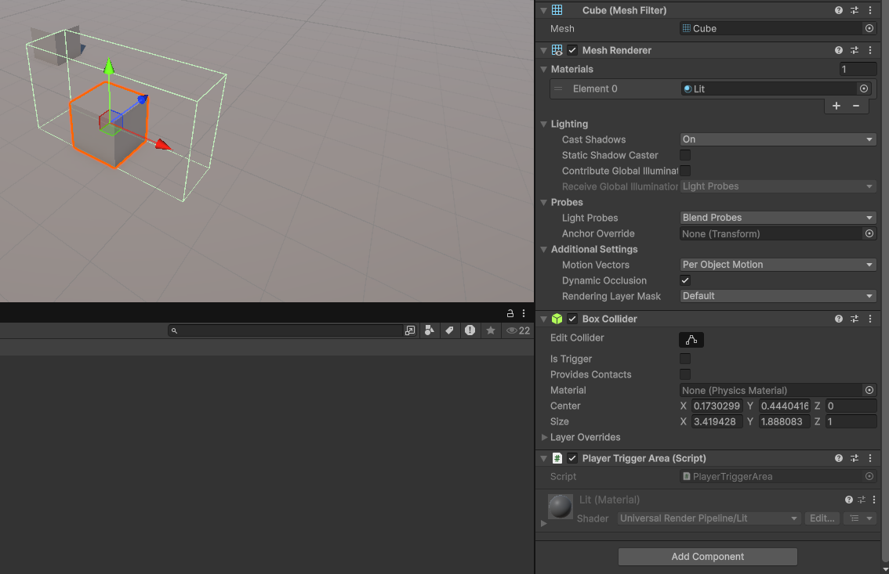
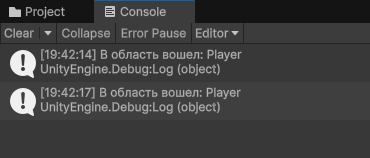
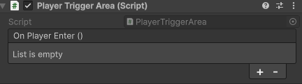
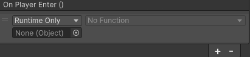
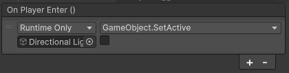
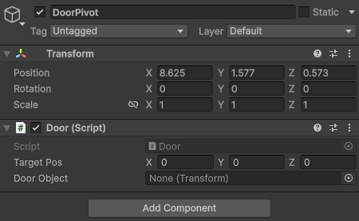
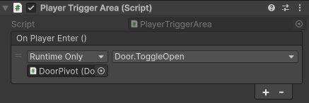

# 1.2 Смотрим на поверхность Unity

Всех приветствую на борту корабля **"Великие плывуны Unity"**. Сегодня я расскажу вам немножечко о Unity. Причем плавать мы будем именно на поверхности, чтобы не захлебнуться.

## Знакомимся с движком

Условимся, что вы уже прочитали статью про [установку Unity](../../guides/installation.md), и он у вас уже готов к работе.

Давайте посмотрим на наш прекрасный интерфейс:



(Если картинку плохо видно, откройте ее в новой вкладке)

Под номером 1 - Иерархия объектов на сцене. В самом верху `SampleScene` - наша открытая сцена. Все объекты на ней приведены под ней - они являются ее **дочерними объектами** (у SampleScene есть треугольничек для скрытия/раскрытия списка, объекты ниже на одну табуляцию правее). Запомните, что это называется иерархией, и как выглядят дочерние объекты. Эти понятия, и как их распознать будут нам очень нужны.

Под номером 2 - Окно `Project` и, собственно, файлы, находящиеся в проекте. Сами файлы. Сцены тут тоже есть - загляните в папочку `Scenes`. Здесь размещаются все файлы проекта. Они создаются нажатием правой кнопки мыши по пустому месту, либо перетаскиваются из других папок. Все файлы желательно разделять по папкам - скрипты в `Scripts`, спрайты в `Sprites`, модели в `Models` и так далее.

Под номером 3 - окно `Scene`. Тут мы можем перемещаться по открытой сцене. Делать это очень просто: в окне сцены зажимаем правую кнопку мыши (далее - ПКМ), и если двигать ее, мы оглядываемся. Чтобы перемещаться, при зажатой ПКМ нажимаем WASD. Если скорости недостаточно, при перемещении можно зажать Shift. Можно отрегулировать скорость, если зажать ПКМ и крутить колесо мыши. Если вдруг потерялись на сцене, можете дважды кликнуть по любому объекту в иерархии, и вы на сцене окажетесь рядом с ним.

Тут же под номером 3.а - инструменты. В первой части инструменты (сверху вниз): перемещение по сцене, перемещение объекта по координатам, поворот объекта, изменение размера объекта, работа с объектами интерфейса и 2D и универсальный инструмент, объединяющий предыдущие. Во второй части кнопки скрытия/отображения некоторых частей интерфейса.

Под номером 4 - Инспектор. Когда мы выберем любой объект на сцене или в файлах проекта, там покажутся все данные и параметры выбранного объекта. С ним мы будем работать даже чаще, чем с окном сцены.

## Постановка задачи

Так, мы же не побаловаться сюда пришли, верно? Поэтому выполним небольшую задачку:

!!! note "Задача"
	Необходимо реализовать дверь, которая открывается когда игрок подходит к ней.

Вроде бы задача максимально приближенная к нашим реальным.

## Немного Thought process

Давайте я на примере распишу, **как** я подхожу к решению подобных задач.

### Use-case

Сначала разбиваем задачу на use-case'ы в голове. Это уже звучит страшно, но не ссым в штаны, все очень просто:

Из объектов в задаче у нас: Дверь, Игрок.

Поведение: Дверь открывается, Игрок подходит.

Условия: Дверь открывается только, если подходит именно игрок.

### Реализация

Теперь думаем про реализацию:

Что означает "дверь открывается"? Условимся, что если сама дверь отъедет, то она открылась. Это значит, что нам достаточно сдвинуть ее по координатам, чтобы она открылась.

Что означает "подошел игрок"? Подошел ведь куда-то, верно? Значит должна быть область, которая может знать, что в нее что-то вошло. Для этого подойдет обычный коллайдер-триггер. Другой вопрос: как мы узнаем, что подошел именно игрок? Триггер срабатывает на любые вхождения в область, поэтому нам нужно отделить игрока. Для такого есть два варианта: попробовать найти у него компонент, который есть **только** у игрока, либо просмотреть на наличие тэга, который есть **только** у игрока. Компонента у нас такого нет, давайте ради простоты ограничимся тэгом.

### Архитектура

И напоследок - составляем мини архитектуру. Обосрались? Что еще раз? Тише, тише, я просто говорю умными словами, поясняю:

Нам нужно сделать область, которая будет ждать, пока в нее кто-то войдет. Если в нее вошел игрок, отодвигаем дверь по координатам. Делим это все по этапам:

1. Ждем пока в область кто-то войдет;
2. Проверяем игрок ли это;
3. Если да, отодвигаем дверь.

Смотрим, сколько из этого получается скриптов. Если вы сказали, что это все один скрипт, то поздравляю! Первый табурет уже навис над вашей головой! Только не смотрите наверх...

Первый пункт точно берем в один скрипт. Туда же можно и второй пункт - получится скрипт, который ждет вхождения игрока в область.

А вот насчет третьего... Если мы запихнем его туда же, то получится дверь, которая открывается только если игрок подошел в указанную область. Но в игре вряд ли **только двери будут открываться** при вхождении игрока в область... Да и двери вряд ли будут открываться **только** таким образом. Если мы так сделаем, нам придется писать тот же код, если, например, нам нужно будет при вхождении в область создавать врагов. Поэтому - рубим их пополам!

### Итого

Первый скрипт - какое-то действие, когда игрок входит в область триггера. Назовем его `PlayerTriggerArea`.

Второй скрипт - открытие двери. Ну и все остальное, что еще с дверью можно делать тоже будет там. Называем `Door`.

Надеюсь, как я пришел к таким выводам ясно. Конечно, для такого разбора нужна практика и немного опыта, но это все у вас приобретется со временем.

## Реализация

### Работа с областью

Ну что, поехали. Начнем с области:

Создаем в папке Scripts новый скрипт: кликаем внутри папки ПКМ, выбираем Create -> MonoBehavior Script. Называем его, как мы задумывали, и окунаемся в несчастное тыканье по клавиатуре.

Итак. Если на объекте есть коллайдер-триггер (у нашей области он будет), то в скрипте при вхождении чего-либо в область, будет вызываться метод OnTriggerEnter. Он уже встроен, и нам только нужно написать что делать, если такое случилось:

```csharp
private void OnTriggerEnter(Collider other)
{
    
}
```

Он у нас пока пустой, но присмотритесь: здесь есть параметр `other` типа `Collider`. Из этого параметра можно получить информацию о объекте, который вошел в эту область. Сечете, что произойдет дальше? Только надо помнить: на конце метода написано Enter, следовательно он **вызовется один раз, когда объект вошел в область**. Если он выйдет и зайдет обратно, он вызовется снова. Короче, срабатывает один раз, когда игрок хотя бы одним пикселем оказывается внутри. Работает отдельно для каждого объекта, который в нем оказался.

Давайте для прикола выведем имя объекта в консоль, если он вошел в область. Писать в консоль можно через `Debug.Log()`.

```csharp
private void OnTriggerEnter(Collider other)
{
    Debug.Log("В область вошел: " + other.name);
}
```

### Инспектор

А давайте сразу проверим, что все работает. Сохраняем скрипт (Ctrl + S) и возвращаемся в редактор.

Нам нужно сначала сделать область. Пусть это будет невидимый кубик. Переходим в иерархию, кликаем по ней ПКМ, выбираем 3D Object -> Cube. Сразу же даем ей говорящее имя - `Area`.



Получается нечто подобное. У нас куб сразу выбран, и переместим его куда-нибудь ближе к полу. После этого нам надо настроить саму область (коллайдер). Но перед этим взглянем на инспектор.



Смотрим, что у нас есть в инспекторе:

1 - Часть `GameObject`. GameObject - это компонент, который есть у каждого объекта, который есть на сцене. В нем устанавливается имя. Так же возле имени есть галочка - показатель того, включен ли объект на сцене, или нет. Попробуйте ради прикола выключить что-то. Получилось? Верните обратно. Также здесь можно выставить тэг для объекта (обратите внимание), и слой, на котором объект находится. Про Static это вообще отдельная речь, пока не трогаем его вообще.

2 - Компонент `Transform`. Он отвечает за расположение объекта на сцене. Он есть у каждого GameObject'а и к нему очень просто получить доступ через `.transform`. Устанавливает позицию по координатам (Position), поворот по каждой из осей (Rotation) и размер (Scale).

3 - Компоненты `Mesh Filter` и `Mesh Renderer`. Вообще, кстати все блоки у объекта в инспекторе - компоненты. Конкретно эти два отвечают за то, как объект выглядит - его модель и материалы соответственно. Заметьте, что их можно тоже выключить - у них есть галочка. Попробуйте выключить Mesh Renderer. Получилось? Молодцы, верните как было.

4 - Компонент `Box Collider`. Один из видов коллайдеров. Коллайдеры отвечают за твердость объекта, за область в которой он будет твердым, и прочие штуки. У него есть `Edit Collider` и `Is Trigger`. Нажмите по первой кнопке. На сцене у кубика появятся маленькие зеленые точки. Если вы за них подергаете, сможете менять область твердости. Сделаете как вам удобно. Заметьте, визуальная часть кубика не двигается, только зеленая окантовка. Эта окантовка и есть область коллайдера. Затем выставим галочку Is Trigger. Если она выставлена, объект перестанет быть твердым, но при этом будет ждать, пока объекты будут попадать внутрь заданной области. Это нам и нужно.

Любые другие компоненты можно добавлять через кнопку `Add Component` снизу. Там при нажатии появится менюшка для выбора, можете по ней прогуляться ради интереса, только не заблудитесь.

Фухх, разобрались. Давайте к нашим баранам.

Находим написанный нами скрипт `PlayerTriggerArea` в файлах проекта. Теперь внимание! Факт для взрыва мозга! Скрипт, который мы написали, это... **тоже компонент**! Только пока ни на чем не висит... Давайте исправим это.

Зажимаем левую кнопку мыши над скриптом в файлах проекта, и аккуратненько тянем его в иерархию. Отпускаем кнопку, когда курсор оказался под нашим объектом Area. И скрипт уже висит на нем в виде компонента!



Вот он, наш родненький! На месте!

Если ошиблись и кинули не на тот объект, у каждого компонента есть справа кнопка-троеточие. Если по нему нажмете, там есть кнопка `Remove Component`, чтобы убрать его.

Давайте же теперь проверим. Нажимаем в самом верху редактора кнопочку играть.

Вместо окна сцены открывается окно игры (Game). Но не боимся, окно сцены там же рядом. Сфокусируемся на тесте.

Рядом с окном файлов проекта (Project) есть вкладочка консоли (Console). Откроем ее. Теперь, если мы войдем в область, выйдем из области и снова войдем, в консоли должно появится это:



Наш скрипт работает, и даже правильно определяет игрока! Шучу, конечно, игрока он не определяет. Если вы в окне сцены перетащите любой другой физичный объект в область, он тоже высветится. Но уже что-то работает, и мы молодцы!

### Тэг игрока

Возвращаемся в код. Нам нужно узнать по тэгу, игрок это или нет.

Напишем условие. Проверку тэга можно сделать прямо у того самого параметра `other` через метод `CompareTag()`.

```csharp
if (other.CompareTag("Player"))
{

}
```

В скобочках указываем строку-название тэга. Пишем "Player" - встроенный тэг Unity. (Не забудьте указать его у самого игрока! Вы теперь знаете, где это делается) Он вернет `true`, если у данного объекта есть такой тэг.

Можете переместить вывод в консоль, который у нас уже есть, внутрь этого условия. Вернитесь в редактор и проверьте, все ли работает точно так же.

### Пишем событие

Теперь нам остается открыть дверь! Которой у нас нет... Давайте вот что сделаем:

Когда игрок вошел в область, мы должны что-то делать, верно? В нашем случае открывать дверь. Если мы в этом скрипте напишем в явном виде открытие двери, то какой смысл от того, чтобы писать два скрипта? Мы сделаем так, чтобы можно было делать все что угодно. Вообще все.

Вхождение в область это событие. Не такое, конечно, значимое, но все же. И давайте сделаем это событием, используя `UnityEvent`.

Выше метода `OnTriggerEnter` напишем новое поле. (проследите, что сверху скрипта появилась строчка `using UnityEngine.Events`)

```csharp
public UnityEvent OnPlayerEnter;
```

Чтобы разобраться получше, сохраним, и сразу перейдем в редактор. У нашего скрипта появилась такая штука:



Если мы нажмем плюсик, то появится вот это:



У нас доступно пустое поле `None (Object)`. Если мы перетащим из иерархии любой объект со сцены, откроется доступ к списку, у которого сейчас значение `No Function`. Для примера перетащите из иерархии Directional Light. В списке появится список компонентов, которые на нем висят. При наведении на каждый компонент, появятся доступные методы у этого компонента. При выборе некоторых под этим списочком появится поле для ввода значения. Так что это такое?

Это список вызываемых методов, который выполнится, когда событие произойдет. В него можно через плюсик добавлять сколько угодно объектов, и у них вызывать нужные методы и передавать параметр. Удобно, правда? Вместо того, чтобы писать в скрипте ссылку на какой-то объект, мы сами в инспекторе выбираем, что произойдет. Для примера выберите любой метод из доступных. Я выберу отключение объекта - (GameObject -> SetActive):



Осталось активировать это событие в коде. Помним, что нам нужно это сделать, когда игрок входит в область. Активация события выглядит вот так:

```csharp
if (other.CompareTag("Player"))
{
    OnPlayerEnter.Invoke();
}
```

Можем сохранить, и проверить. При вхождении игроком в область свет на сцене **отключается**. При повторном вхождении **не включается**, потому что происходит **одно и то же** - мы обращаемся к Directional Light, у него к компоненту `GameObject` и вызываем метод `SetActive` с параметром `false` (мы не прожали галочку под `GameObject.SetActive`). Его никто обратно не включает, поэтому ничего другого и не происходит.

Итоговый скрипт для проверки:

```csharp
using UnityEngine;
using UnityEngine.Events;

public class PlayerTriggerArea : MonoBehaviour
{
    public UnityEvent OnPlayerEnter;

    private void OnTriggerEnter(Collider other)
    {
        if (other.CompareTag("Player"))
        {
            OnPlayerEnter.Invoke();
        }
    }
}
```

Поздравляю! Мы написали скрипт на уровне полу-профессионала, который идеально работает! Мы можем указывать вызов любых методов у любых объектов и можете спокойно поиграться с этим. Но не увлекайтесь, ведь у нас еще осталась...

### Дверь

Создайте на сцене еще один кубик, назовите его Door, разместите его рядом с областью, растяните его немного, чтобы он немного походил на дверь (растягивайте именно кубик, а не его область коллайдера! это делается через инструменты сцены). Когда закончите, выключите компонент Mesh Renderer у области.

Создаем в папочке `Scripts` новый скрипт - `Door`. Избавляемся от всего лишнего и погнали думать.

В задаче нам нужно открывать дверь. А про закрывать никто не говорил. Ну давайте, все таки сделаем и закрытие тоже.

У двери есть два состояния: закрыто, открыто. В каждом из состояний меняются ее координаты. Поэтому нужны начальные координаты (состояние закрыто), и конечные координаты (состояние открыто). А теперь еще раз подумаем. Если нам придется перемещать дверь, нам нужно будет снова обновлять координаты. Удобно ли это? Нет конечно.

За начальные координаты возьмем позицию, когда игра только запустилась. А конечную будем задавать.

Только добавим одну супер фишку: если мы сделаем нашу дверь дочерним объектом пустого объекта, на котором будет висеть наш скрипт (вспоминаем, что значит дочерний объект), то координаты двери будут относительными. Тогда при сдвиге двери нам вообще ничего менять не надо! Разве не сказка?

Для этого в иерархии находим нашу дверь и тыкаем по ней ПКМ. В списке выбираем `Create Empty Parent`. Таким образом у двери появляется объект родитель, который мы назовем `DoorPivot `(якорь/петля двери). Обратите внимание, как изменились координаты самой двери. Они встали по нулям! (0, 0, 0).

Едем в скрипт. Заводим переменную состояния `isOpen` (состояния два - хватит буля), координаты открытия `targetPos`, и начальные координаты `initPos`. Координаты - трехмерный вектор `Vector3`.

```csharp
private bool isOpen;

public Vector3 targetPos;

private Vector3 initPos;
```

Делаем публичным только поле `targetPos` - мы его будем заполнять в инспекторе.

Теперь позаботимся вот о чем: мы двигаем не якорь двери, а **саму дверь**. То есть нам нужна ссылка на эту дверь. Нам от нее нужно только изменение позиции, поэтому мы получим ее из какого компонента?... правильно, из Transform:

```csharp
public Transform doorObject;
```

Так же оставляем его публичным, мы закинем туда ссылку на дверь.

Создаем собственный метод - `ToggleOpen`:

```csharp
public void ToggleOpen()
{

}
```

Делаем его публичным, мы к нему будем потом обращаться. А назван он по простому принципу: метод будет закрывать дверь, если она открыта и открывать в обратном случае. То есть переключает состояние. Состояние у нас Open, а глагол, который принято использовать для переключения состояния - Toggle.

Теперь пишем логику: если дверь открыта (`isOpen == true`), то выставляем дверь на начальные координаты и выставляем состояние в позицию `false`. Иначе, выставляем дверь на целевые координаты и выставляем состояние в позицию `true`. В коде это выглядит так:

```csharp
public void ToggleOpen()
{
    if (isOpen)
    {
        doorObject.localPosition = initPos;
        isOpen = false;
    }
    else
    {
        doorObject.localPosition = targetPos;
        isOpen = true;
    }
}
```

У Transform есть свойство позиции - `.localPosition`. Оно возвращает координаты, на которых объект находится, относительно родителя. А также мы можем и своими ручками эти координаты поменять на нужные, что мы и делаем здесь.

Не забываем, что нам нужно выставить еще начальные координаты. Делаем это всего один раз, в методе Start, который вызывается лишь однажды:

```csharp
private void Start()
{
    initPos = doorObject.localPosition;
}
```

И все, наш скрипт готов! Выглядит он вот так:

```csharp
using UnityEngine;

public class Door : MonoBehaviour
{
    private bool isOpen;

    public Vector3 targetPos;

    private Vector3 initPos;

    public Transform doorObject;

    private void Start()
    {
        initPos = doorObject.localPosition;
    }

    public void ToggleOpen()
    {
        if (isOpen)
        {
            doorObject.localPosition = initPos;
            isOpen = false;
        }
        else
        {
            doorObject.localPosition = targetPos;
            isOpen = true;
        }
    }
}
```

Теперь сохраняем и бежим в редактор!

### Белыми нитками шиты

Перетаскиваем новоиспеченный скрипт на `DoorPivot` (не `Door`!).



Перетаскиваем из иерархии `Door` в поле `Door Object`. Теперь нам остается выставить координаты состояния открытия. Выделите саму дверь и подвиньте ее туда, где вам кажется, она будет открыта. Перепишите координаты двери в `Target Pos` у скрипта и **обязательно верните дверь на нулевые координаты**.

Прекрасно! Возвращаемся к области. В событии, в поле объекта перетаскиваем `DoorPivot` (на нем висит скрипт `Door`). В методах выбираем наш компонент `Door` и в нем метод `ToggleOpen`. Заметьте, никакого поля для параметра не появляется - в нашем методе `ToggleOpen` нет никаких параметров.



И все! Бежим проверять! При подходе к двери, она открывается. Если мы пройдем через нее, а потом вернемся, она закроется за нами.

## Заключение

Ну что, ребят, страшно было? А ведь мы подошли к решению задачи на высочайшем уровне, при почти нулевых знаниях! За тем исключением, конечно, что у нас куча полей публичные... но это дело поправимое. Во всяком случае мы даже не нарушили ни одного принципа SOLID, что просто нереально!

Если вы будете подходить к решению задач в таком ключе, вам не только будет проще их решать, но и проще находить помощи в их решении, что не мало важно на вашем уровне. Поэтому дерзайте!

## Задание

*Маленький Олег*: "А как же домашнее задание?"

Ах, да, точно. Спасибо, что напомнил, а то вы бы пошли гулять.

Задание следующее: после того, как вы получите свое первое задание, проведите Thought process в таком же формате, как указано у меня. Пришлите его мне, и я расскажу, насколько сильно *я вас "люблю"*. В добавок выпишем `n`-ое количество ударов табуретом по голове в качестве профилактики. Шучу. Действуем.