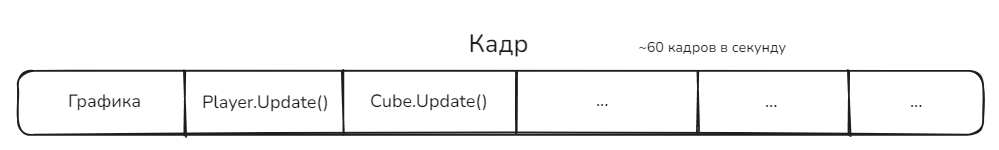
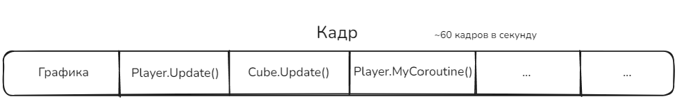

# 2.2 Корутины

Сегодня поговорим о корутинах (Coroutines) в Unity. Это очень интересная тема, с виду простая, но на практике ими мало кто пользуется, а если пользуются, то не совсем понимают зачем.

## Введение

Представим, что у мы делаем простенький кликер. Кликер про уборку мусора: на каждом уровне появляется мусор, по которому мы кликаем, зарабатываем этим монетки.

И жанр кликеров бы умер в зародыше, если бы не было дополнительных механик. Например, мы хотим сделать так, что за монетки можно купить улучшение, которое дает пассивную прибавку монеток, и улучшение, которое раз в несколько секунд само убирает мусор вместе с игроком.

Если что, это пример моего реального проекта, который я сделал буквально за два дня, и его полный код можно найти [здесь](https://github.com/FrostHoll/CleaningClicker).

Давайте взглянем на то, с чем мы будем работать, а конкретно класс игрока:

```csharp
public class Player : MonoBehaviour
{
	//...
    private Money _money = new Money();

    public Money Money
    {
        get
        {
            return _money;
        }
        set
        {
            _money = value;
            MoneyChanged?.Invoke(_money);
        }
    }
    
    public void OnTrashClicked(GameObject target)
    {
        var m = _playerUpgrades.GetMoneyPerClick();
        //...
        Money += m;
    }
    //...
```

Давайте сразу подмечу, что у нас тут есть:

- Закрытое поле `_money`, которое обозначает текущее количество монеток у игрока. Тип `Money` это мной написанный класс, который реализует деньги, с уходом в очень большие числа. Я показывать его не буду, ибо сейчас нам это не интересно.
- Свойство `Money`, которое оборачивает поле `_money`, и при изменении количества денег (блок `set`) сообщает всем, что деньги поменялись (этим пользуются текст с количеством денег и кнопки улучшений).
- Метод `OnTrashClicked`, который вызывается, когда по мусору кликнули. Он получает из текущих улучшений количество денег за клик, и затем начисляет его на счет.

Как видите, ничего интересного. Поэтому давайте думать, как реализовать наши новые механики.

Сначала пассивный доход. Наш апгрейд звучит так:

!!! note "Пример пассивного дохода"
	Рабочие - Каждые 3 секунды на счет прибавляется 120 монеток. С каждым уровнем прибавляется количество дохода.

Естественно, первое что придет нам на ум, это сделать таймер на три секунды, и начислять нужную сумму на счет. Давайте сделаем это:

```csharp
private float currentWorkersTimer = 0f; // таймер

private float workersTime = 3f; // время таймера

private void Update()
{
	if (HasWorkers) // проверяем есть ли такой апгрейд
	{
		if (currentWorkersTimer <= 0f) // пора ли начислять
		{
			Money += 120;
			currentWorkersTimer = workersTime; // сброс таймера
		}
		currentWorkersTimer -= Time.deltaTime; // уменьшаем таймер
	}
}
```

Вроде все просто. Но только давайте вот что подумаем, а если прибавится таких таймеров? Например еще один апгрейд на каждые 5 секунд? А еще на каждую одну секунду? Сколько строчек у нас будет занимать **Update**, и как скоро мы в нем начнем теряться?

Теперь второй апгрейд:

!!! note "Пример автокликера"
	Помощники - Каждые 8 секунд совершают `n` кликов по случайному мусору на экране. С каждым уровнем увеличивается кол-во кликов. Каждый автоклик должен быть визуально заметен.

Итак, сразу видно "каждые 8 секунд" - значит снова таймер (еще один!). Причем каждый клик должен быть визуально заметен...

```csharp
private float currentHelpersTimer = 0f;

private float helpersTime = 8f;

private void Update()
{
	if (HasHelpers)
	{
		if (currentHelpersTimer <= 0f)
		{
			// ???
			currentHelpersTimer = helpersTime;
		}
		currentHelpersTimer -= Time.deltaTime;
	}
}
```

Делаем по аналогии с прошлым, но что мы должны делать при срабатывании таймера? Если мы просто сделаем цикл, в котором будем вызывать метод `OnTrashClicked()`, то это не будет визуально заметно - все произойдет в одном кадре, и это больше выглядеть как баг, а не фича...

Значит нам нужно делать клики с небольшим перерывом. То есть завести поле под таймер между кликами, поле на время между кликами, поле сколько кликов нужно сделать, поле сколько кликов уже сделано...

Не знаю как вы, но меня уже тянет блевать только от мысли писать **такой** код. Если вы все же хотите написать такой код, то пишите... А потом разочаруйтесь в жизни...

Короче, все эти проблемы прекрасно решат корутины. Давайте с ними познакомимся.

## Что такое Корутины

**Корутины (Coroutines)** - специальные функции Unity, которая может приостанавливать свое выполнение и возобновлять его позже, не блокируя основной поток игры.

Описываются они примерно таким образом:

```csharp
IEnumerator MyCoroutine()
{
	// код
    yield return ...;
}
```

Отличительной чертой корутин является возвращаемый тип `IEnumerator` и использование `yield return` в теле метода.

Через `yield return ...` мы задаем, когда стоит вернутся к выполнению этой корутины (это называется **передачей управления**). Если не задавать его, то это будет самый обычный метод. Можно задать, например: `new WaitForEndOfFrame()` - дождаться следующего кадра, `new WaitForSeconds(s)` - выждать `s` секунд и другие.

А вот про `IEnumerator` будет чуть ниже.

Корутины вызываются/останавливаются следующим образом:

```csharp
var coroutine = StartCoroutine(MyCoroutine());
StopCoroutine(coroutine);
StopAllCoroutines();
```

### Пример работы

Рассмотрим, как себя будет вести вот такая корутина:

```csharp
StartCoroutine(TimedHello());

IEnumerator TimedHello()
{
	Debug.Log("Hello, ");
	yield return new WaitForSeconds(5f); // <-- (1)
	Debug.Log("world!");
}
```

После запуска корутины, она сразу выведет в консоль `"Hello,"`. На строчке **(1)** корутина "уйдет на покой", и будет ждать 5 секунд. Через 5 секунд выполнение продолжится с той строчки, где она была остановлена в прошлый раз, то есть со строчки **(1)**. Поэтому далее она выведет `"world!"` и на этом завершит свою работу.

Важно подметить две вещи:

1. Можно запускать сколько угодно одинаковых корутин, и они будут работать отдельно друг от друга. На нашем примере, если бы мы запустили сразу 10 таких корутин, то сначала бы вывелось 10 "Hello", а потом через 5 секунд еще 10 "world!". Они не зависят друг от друга, и если бы мы их запускали с задержками, их выводы бы тоже сместились.
2. Корутины работают асинхронно, а не параллельно. Это означает, что корутины работают в пределах основного потока игры, и если в ней будет бесконечный цикл без передачи управления, игра намертво зависнет. Подробнее про это в следующем разделе.

### Почему IEnumerator?

Корутины должны возвращать объект типа `IEnumerator`. Почему?

Вообще `IEnumerator` - интерфейс, который реализуют итераторы коллекций. Звучит страшно, но вот простыми словами:

Коллекция - любой объект, который содержит в себе другие объекты (например списки, массивы, стэки и т.д.)

Итератор - объект, который помогает итерироваться по коллекции. То есть штучка, которая знает на какой объект, например в списке, мы сейчас смотрим, и какой следующий.

**Почему это применимо к корутине?**

Любая игра у нас работает покадрово. То есть на каждом кадре происходит отрисовка графики, и другой функционал.

Мысленно любой кадр можно разбить на таймлайн:



Где, например, кроме графики, обязательно происходят вызовы Update у каждого объекта. И другие вещи. Это все подзадачи, которые выполняются каждый кадр.

Все эти подзадачи собирает в одну коллекцию **планировщик**, и начинает по ней проходить, одна за одной отрисовывая кадр. Эта коллекция и есть основной поток игры.

И уже тут, думаю, становится понятно, что если в одном из `Update` сделать бесконечный цикл `while`, то игра намертво зависнет - этот цикл будет работать бесконечно, а все остальные задачи не будут выполняться, ибо они ждут, пока завершится этот Update.

Так вот, когда мы запускаем корутину, она становится частью основного потока, и точно так же попадает на таймлайн:



А внутри происходит самое интересное. Давайте я еще раз покажу код корутины, чтобы не листать:

```csharp
IEnumerator TimedHello()
{
	Debug.Log("Hello, ");
	yield return new WaitForSeconds(5f); // <-- (1)
	Debug.Log("world!");
}
```

Компилятор превращает каждый вызов `yield return` в отдельное состояние, в котором корутина может находиться. Здесь получается два состояния: **до строчки (1)** и **после строчки (1)**. Они становятся **этапами** выполнения корутины, аналогично элементам массива. Они и возвращаются из корутины при каждом вызове `yield return`.

На каждом кадре Unity проверяет, стоит ли перейти к следующему этапу выполнения. На примере здесь - он просматривает внутренний таймер, который создается посредством `WaitForSeconds()`, и если нужное время прошло, можно переходить дальше.

На простом примере то понятно, как это работает, но в сложных примерах работает точно так же. Если бы мы засунули передачу управления в цикл, там бы происходило то же самое, с сохранением всех индексов и так далее.

О корутинах проще думать как о отдельных программах, к которым мы возвращаемся время от времени, что-то делаем, а потом оставляем.

## Применяем корутины

### Переделываем пассивный доход

А теперь давайте переделаем сначала пассивный доход, используя корутины:

```csharp
private IEnumerator PassivePerSecond(int seconds, GameObject targetDisplay)
{
    while (true)
    {
	    // приостанавливаемся на seconds секунд
        yield return new WaitForSeconds(seconds); 
	    
	    // берем текущий доход в seconds секунд
        var money = _playerUpgrades.GetMoneyPerSecond(seconds);
         
        if (!money.IsZero)
        {
            Money += money;
            // ..
        }
    }
}
```

Эта корутина рассчитана на любое количество секунд: она будет приостанавливаться и выжидать `seconds` секунд, выполнять код (в данном случае выдавать доход), а затем снова "засыпать" на `seconds` секунд. И это происходит бесконечно (`while (true)`). Но из-за того, что мы передаем управление в `yield return`, выполняется и другой код, а игра не зависает. Просто эта корутина бесконечно висит на фоне и раз в `seconds` секунд дает доход, если он есть.

А вызывается она очень просто, в `Awake`:

```csharp
private void Awake()
{
	// ...
    StartCoroutine(PassivePerSecond(3, GameController.Instance.WorkersDisplay));
}
```

### Переделываем автоклики

Я немного разделил это надвое: все таки логика таймера и логика несколько идущих подряд автокликов не очень связаны.

Поэтому корутина на автоклики выглядит следующим образом:

```csharp
private IEnumerator HelpersCoroutine(GameObject targetDisplay)
{
    while(true) 
    {
	    // приостанавливаемся на 8 секунд
        yield return new WaitForSeconds(8);
        
        // получаем кол-во автокликов
        var count = _playerUpgrades.GetHelpers();
        
        if (count != 0)
        {
            GameController.Instance.AttackRandomTargets(count); // <-- (1)
            //...
        }
    }
}
```

Здесь тоже `while(true)`, приостановка на 8 секунд. Однако на строчке **(1)** происходит вызов вот этого:

```csharp
public void AttackRandomTargets(int times)
{
    if (_currentBG != null)
        StartCoroutine(_currentBG.AttackRandomTargets(times));
}
```

Вы только посмотрите! Старт еще одной корутины! Да ну нахер! Давайте взглянем на нее:

```csharp
public IEnumerator AttackRandomTargets(int times)
{
    while (times > 0) // если нам еще нужно сделать автоклик
    {
	    // приостанавливаемся на 0.1 секунду
        yield return new WaitForSeconds(0.1f);
        
        if (_currentTrash.Count == 0) break;
        int index = UnityEngine.Random.Range(0, _currentTrash.Count);
        if (_currentTrash[index] != null)
            _currentTrash[index].Attack(); // <-- автоклик
        times--;
        // дожидаемся конца кадра
        yield return new WaitForEndOfFrame();
    }
}
```

Эта корутина кликает по случайному мусору на экране, выжидает 0.1 секунду и повторяет процесс `times` раз. Где `times` это и есть кол-во автокликов.

Сразу проясню: `WaitForEndOfFrame` дожидается конца кадра, то есть когда все предыдущие подзадачи на кадре выполнены. Если бы эта корутина содержала **только** `WaitForEndOfFrame`, это получился бы аналог `Update` (он работает таким же образом).

Наверняка вы задаетесь вопросом (а лучше бы задавались), на какой черт нужно дожидаться конца кадра, если мы итак ждем 0.1 секунду?

Дело в том, что мы работаем с объектами, которые вполне могут быть удалены между кадрами, а также присутствует отрисовка анимаций между "атаками" (в вызываемом методе `Attack`). Вот это все происходит между кадрами, которые ко времени не привязаны. То есть, если между кадрами будет больше 0.1 секунды (случайный фриз), то пройдет еще одна итерация, до того, как сработала анимация и до того как объект успешно удалится. Последствия вполне себе можете представить.

## Продвинутое применение корутин

В примере вы видели, что я написал корутины, которые не останавливаются. Давайте я вам покажу пример корутины, которая останавливается и не только.

В [статье про паттерн Стратегия](../lvl_4/best_practices.md#_2) я уже показывал про проект визуальной новеллы. Там мы с вами смотрели команды по перемещению персонажей по экрану.

Вообще у любой команды есть корутина по ее выполнению, а также возможность ее прервать.

```csharp
public abstract class ScenarioCommand : ICommandFinishHandler
{
	// ...
    public abstract IEnumerator Execute(); // корутина выполнения

    public virtual bool TryForceSkip() // прерывание выполнения
    {
        return true;
    }

    public void CommandFinish() // ???
    {
        Context.CommandFinish.Invoke();
    }
}
```

Каждая команда сама реализует то, как она выполняется (`Execute`). Кроме того, нам нужно отдельно прописать ее прерывание (`TryForceSkip`), чтобы персонаж, например, не оказался непонятно где, если мы посередине пути прервем команду передвижения. А вот `CommandFinish` стоит запомнить - это темная лошадка, которая нам пригодится.

Так вот, давайте вспомним команду передвижения:

```csharp
public class MoveCharacterCommand : ScenarioCommand, IScenarioFunctionalCommand
{
    // ...

    public override IEnumerator Execute()
    {
        return Context.CharacterManager.MoveCharacter(_charCode, _args, this);
    }

    public override bool TryForceSkip()
    {
        Context.CharacterManager.ForceMoveCharacter(_charCode, _args);
        return true;
    }
}
```

Здесь вместо того, чтобы прописывать что делает корутина, мы возвращаем другую корутину - `MoveCharacter`. Мы ее рассматривали еще в той статье, и при желании вернитесь туда. Я этим хотел подчеркнуть то, что суть корутины не совсем код, как факт возврата тех самых точек приостановки `yield return ...`.

Давайте посмотрим, где команды вообще вызываются - в контроллере сценария:

```csharp
// ссылка на корутину
private Coroutine c_executingCommand;

// есть ли корутина выполнения
private bool IsCommandExecuting => c_executingCommand != null; 

// ...

private void ExecCommand()
{
    _currentCommand = _scenario[_position];
    _position++;
    c_executingCommand = StartCoroutine(_currentCommand.Execute());
}
```

Когда выполняется очередная команда, стартует новая корутина и **ссылка на корутину** сохраняется в поле `c_executingCommand`. По этому полю можно ее остановить при прерывании:

```csharp
private void Update()
{
    if (Input.GetKeyDown(KeyCode.Space))
    {
        if (IsCommandExecuting) // если есть корутина выполнения
        {
            if (_currentCommand.TryForceSkip())
            {
                StopCoroutine(c_executingCommand); // <-- остановка
                OnCommandFinished(); // обозначаем окончание выполнения
            }
            else
            {
                Debug.Log("Unable to force skip");
            }
        }
        else
        {
            ExecCommand(); // выполняем следующую
        }
    }
}
```

Полистайте код туда сюда минутку-другую. Потом продолжим.

Так вот. Сама корутина никому не говорит, что она закончила свою работу. Поэтому в конце каждой команды нужно в явном виде говорить о том, что команда завершена. Этим занимется вызов `CommandFinish` в абстрактном классе команды. И тут есть одна огромная загвоздка, с которой вы можете столкнуться. Давайте на примере попроще:

```csharp
Coroutine c;

void Start()
{
	c = StartCoroutine(MyCoroutine()); 
}

void OnFinish()
{
	c = null;
}

IEnumerator MyCoroutine()
{
	Debug.Log("alive");
	OnFinish();
	yield return new WaitForSeconds(10f);
	Debug.Log("still alive");
}
```

Мы запускаем корутину и сохраняем на нее ссылку в `c`. В корутине выводится "alive" в консоль и обнуляется ссылка на корутину. Как вы думаете, что произойдет?

Ну во-первых, обнуление ссылки не приостанавливает корутину. Поэтому через 10 секунд выведется сообщение "still alive". Но тут есть еще один прикол.

Все 10 секунд ожидания ссылка на корутину в `c` **все еще будет**. Не дошло в чем прикол? Посмотрите еще раз код.

Мы обнулили ссылку (`c = null` в `OnFinish`), а только потом поставили ожидание. Даже если мы обнулили ссылку, она **вернется** в `c`, как только корутина дойдет до любого `yield return`.

Поверьте, вы **не хотите** получить ответ почему так. Вам не надо туда лезть. Потому что...


Это действительно тонко. Поймет не каждый.

Ладно, если серьезно, забейте. Это сделано для того, чтобы можно было прерывать корутину, даже если мы случайно обнулили ссылку. Знать **почему** это так работает вам точно не нужно. Если кто-то захочет объяснения, спросите у меня в лс.

Из этого вам нужно понять лишь то, что **корутина либо останавливается сама, либо через StopCoroutine**. И проверку того, что она все еще работает **делайте вручную через флаги**, а не через проверку переменной типа `Coroutine` на `null`.

## Итог

Давайте подытожим для чего используются корутины:

- Для действий с задержками;
- Для периодических, но не каждокадровых задач;
- Для асинхронных операций (ожидание получения данных от сервера например).

Помните, что корутины это тоже не панацея. Используйте их там, где считаете нужным, а не везде. И не стоит ими заменять `Update`.

## Задание

Заданием для вас будет за время проекта реализовать хотя бы одну корутину, и подробно объяснить, как она работает. (Ренату это тоже касается!)