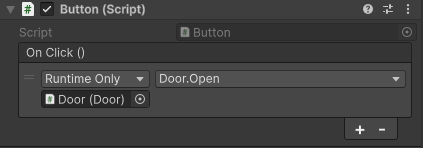
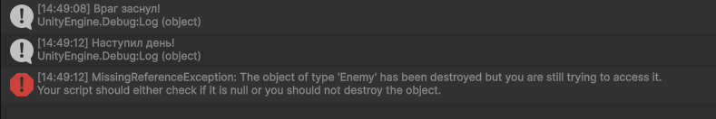

# 2.4 События в Unity

Мы уже вскользь упоминали события в разделе [поверхность Unity](../lvl_1/1_2_unity_start.md), когда пытались реализовать открытие двери, когда к ней подходит игрок. Помните? Я тоже думаю, что нет. Так что в этот раз попробуем хорошенько разобраться, что же это такое и как это использовать. 

## Что такое событие?

**Событие** — это способ сообщить объектам в игре: _«Эй, что-то произошло!»_. Например:

- Игрок подобрал монету.
- Дверь открылась.
- Здоровье упало до нуля.

Вместо того чтобы постоянно проверять _«А не случилось ли что?»_, объекты могут **подписаться** на событие и реагировать, когда оно произойдёт.

Предположим, у нас на сцене есть дверь, которая должна открываться по нажатию кнопки. Давайте рассмотрим следующие примеры реализации:

#### 1. Без использования событий:

```C#
public class Button : MonoBehaviour
{
    public Door door; // Жёсткая привязка к двери!

    void OnMouseDown()
    {
        door.Open(); // Прямой вызов
    }
}
```

В этой реализации мы не используем события, так что подумаем, что нужно, чтобы в одном скрипте вызывался метод из другого скрипта? Правильно, нужно, чтобы в одном из них была ссылка на другой. Кнопка теперь имеет ссылку на дверь, что добавляет ненужных зависимостей. К тому же, метод `Open()` должен быть публичным, что уже нарушает инкапсуляцию. 

#### 2. С использованием UnityEvent

```C#
// Button.cs
using UnityEngine;
using UnityEngine.Events; // Для UnityEvent

public class Button : MonoBehaviour
{
    public UnityEvent OnClick; // Событие, настраиваемое в инспекторе

    void OnMouseDown()
    {
        OnClick.Invoke(); // Вызываем событие
    }
}
```

```C#
// Door.cs
public class Door : MonoBehaviour
{
    private void Open()
    {
        transform.position += Vector3.up * 2; // Просто двигаем дверь вверх
    }
}
```

После добавления скрипта Button.cs на кнопку, в инспекторе у кнопки появится окошечко, в котором мы можем указать, какие методы должны подписаться на событие `OnClick`. Нажмем на "+", перетащим туда наш объект двери и выберем из выпадающего окна `Door.Open()`. Должно получиться так:



Итак, после всего этого можно задать вполне логичный вопрос: да, зависимости это плохо, но зачем нам нужны события, если для них нужно делать столько лишних действий? И до этого ведь работало. 
Давайте по порядку. Сначала разберемся, что мы тут натворили:

1. В классе Button мы добавили `UnityEvent OnClick` и поместили его в `OnMouseDown`. Он будет кричать всем, кто на него подписался: *"Случилось невероятное! Игрок нажал на кнопку! Делайте то, что должны делать!"*
2. В классе Door мы описали простой метод открывания двери. Обратите внимание, теперь он private, все в порядке.
3. В инспекторе на кнопке мы указали, что на событие `OnClick` должен реагировать метод `Open()` из класса Door. 

Теперь каждый раз, когда игрок нажмет на кнопку, вызовется событие `OnClick`. Таким образом вызовутся все, кто на него подписан, а подписан у нас пока только метод открывания двери, так что дверь, правильно, откроется. 

Мы избавились от зависимостей и проблем с инкапсуляцией. А еще знаете что? Допустим, что при открывании двери должен проигрываться звук. И включаться свет. И спавниться враги. Вы представляете, сколько нужно будет ссылок на разные объекты, если бы мы не использовали события? А так мы можем просто в инспекторе нажать еще раз "+", перекинуть нужный объект (управляющий звуком, светом, спавном врагов и так далее) и указать метод, который должен вызываться, то есть подписать все эти методы на событие. 

Чем меньше скрипты знают друг о друге - тем лучше.

## Типы событий в Unity

#### 1. Встроенные события в Unity

На самом деле, вы уже давно работаете с событиями, сами того не подозревая. Ведь уже известные и привычные вам `OnTriggerEnter()`, `OnDestroy()` и подобные - это тоже события, которые встроены в Unity, их можно спокойно использовать без объявления. 

#### 2. Action

**Action** - это что-то вроде указателя на функцию. В него можно поместить другие методы, которые будут вызваны при вызове `Action`. Вот простой пример, в котором при нажатии на ЛКМ в консоль будет выводиться текст `Hello!`:

```C#
public class Test : MonoBehaviour
{
    private Action exampleAction; // Создаем Action

    private void Start()
    {
        exampleAction = SayHello; // Кладем в Action метод SayHello()
    }

    private void Update()
    {
        if (Input.GetMouseButtonDown(0))
        {
            exampleAction.Invoke(); 
            // Каждый кадр проверяется, не нажал ли игрок ЛКМ. 
            // Если нажал, то вызывается то, что внутри Action
        }
    }

    private void SayHello()
    {
        Debug.Log("hello");
    }
}
```

Для присваивания методов в `Action` можно использовать как `+=`, то есть подписать методы на `Action`, так и просто `=`. Использование знака равно удалит все предыдущие подписки, теперь в нем будет лежать только один новый метод, который мы присвоили. Вызов подписчиков происходит уже знакомым нам образом, через `.Invoke()`. 

Давайте рассмотрим пример посложнее и поймем, почему `Action` лучше не использовать для наших задач. 

Допустим, в нашей игре при наступлении дня враги засыпают. Наступление дня - глобальное событие. Создадим скрипт, который будет отвечать за такие события, назовем его `GlobalEventManager` (для простоты не будем прописывать лишнюю логику, ограничимся нажатиями кнопки и выводом сообщений в консоль):

```C#
using System;
using UnityEngine;

public class GlobalEventManager : MonoBehaviour
{
	public static Action OnDayStart;  // Событие начала дня

    void Update()
    {
        if (Input.GetKeyDown(KeyCode.D))
        {
            Debug.Log("Наступил день!");
            OnDayStart.Invoke();  // Вызываем всех подписчиков
        }
    }
}
```

Теперь создадим скрипт врага, который и будет подписываться на события глобального менеджера:

```C#
public class Enemy : MonoBehaviour
{
    void Start()
    {
        GlobalEventManager.OnDayStart += Sleep; // Подписка на событие начало дня
    }

    void Sleep()
    {
        Debug.Log("Враг заснул!");
        GetComponent<Rigidbody>().linearVelocity = Vector3.zero;
        // Тут может быть другая логика, просто для примера 
        // обратимся с какому-нибудь компоненту объекта
    }
}
```

При нажатии клавиши `D` (будто бы наступил день), в консоль выведется сообщение `Враг заснул!`. Вроде бы все нормально. Но что будет, если мы ночью убьем этого врага, а потом наступит день? Будет это:



Объект врага удалился, однако подписка на `Action` все еще осталась. Для того, чтобы этого не произошло, необходимо в `OnDestroy()` врага вручную отписываться от события при помощи `-=`:

```C#
	void OnDestroy()
    {
        GlobalEventManager.OnDayStart -= Sleep;  // Отписываемся при смерти
    }
```

Если событий будет много, то мы обязательно забудем где-нибудь от чего-нибудь отписаться, что вызовет большое количество ошибок, которые будет трудно отследить. В нашем примере все прошло относительно успешно, ведь вызвалась ошибка, а она могла и не появиться. Кроме того, при использовании `Action` любой внешний код может перезаписать все события, используя знак равно или обнулить все подписки (`= null`). 

#### 3. event Action

`event Action` это защищенная версия `Action`, которая:

- Запрещает перезапись событий извне (нельзя использовать знак равно)
- Позволяет только добавлять/удалять подписчиков (через `+=` и `-=`)

При использовании `event Action` мы с очень высокой вероятностью будем ловить баги, вызванные тем, что мы забыли где-то отписаться от события, потому что подписываться и отписываться нам может понадобиться не только в `Awake()` и `OnDestroy()`. 

Еще один важный момент, который я до сих пор не упомянул: при вызове события (`Invoke()`) нам всегда нужно проверять, есть ли у него вообще подписчики, иначе мы словим ошибку `nullreferenceexception`. Для этого существует короткая запись, нужно поставить знак `?` перед точкой в вызове:

```C#
if (OnDayStart != null)
{
    OnDayStart.Invoke();
}

// Эквиевалентно

OnDayStart?.Invoke();
	
```

Обновленный работающий код с `event Action`:

```C#
// GlobalEventManager.cs
using System;
using UnityEngine;

public class GlobalEventManager : MonoBehaviour
{
    public static event Action OnDayStart;

    void Update()
    {
        if (Input.GetKeyDown(KeyCode.D))
        {
            Debug.Log("Наступил день!");
            OnDayStart?.Invoke();
        }
    }
}

// Enemy.cs
using UnityEngine;

public class Enemy : MonoBehaviour
{
    void Start()
    {
        GlobalEventManager.OnDayStart += Sleep;
    }

    void Sleep()
    {
        GetComponent<Rigidbody>().linearVelocity = Vector3.zero;
        Debug.Log("Враг заснул!");
    }

    private void OnDestroy()
    {
        Debug.Log("Отписка!");
        GlobalEventManager.OnDayStart -= Sleep;
    }
}
```

#### 4. UnityEvent

Мы все еще следим за тем, чтобы в нужный момент методы отписывались и прописываем это напрямую в коде. Но эти проблемы запросто решаются с использованием `UnityEvent`. Давайте перепишем наш код:

```C#
// GlobalEventManager.cs
using UnityEngine;
using UnityEngine.Events;

public class GlobalEventManager : MonoBehaviour
{
    public static UnityEvent OnDayStart = new UnityEvent();

    void Update()
    {
        if (Input.GetKeyDown(KeyCode.D))
        {
            Debug.Log("Наступил день!");
            OnDayStart?.Invoke();
        }
    }
}

// Enemy.cs
using UnityEngine;

public class Enemy : MonoBehaviour
{
    void Start()
    {
        GlobalEventManager.OnDayStart.AddListener(Sleep);
    }

    void Sleep()
    {
        GetComponent<Rigidbody>().linearVelocity = Vector3.zero;
        Debug.Log("Враг заснул!");
    }
}
```

Для добавления подписчиков на `UnityEvent` нужно использовать `AddListener()` вместо `+=`. Обратите внимание, что мы нигде не отписывались, но при этом при смерти врага и наступлении дня все работает, никаких ошибок, враг уничтожился и сам отписался от события без нашего участия. 

Этот подход хорош еще и тем, что нам необязательно прописывать в коде подписчиков, ведь мы можем делать это через инспектор, как я показывал в самом первом примере с дверью и кнопкой.

## Передача параметров 

События могут передавать различные значения в вызовы подписчиков. Допустим, мы хотим сделать так, чтобы на экране отображалось количество оставшихся врагов. 

```C#
public class GlobalEventManager
{
	// Событие с передаваемым значением типа int
	public static UnityEvent<int> OnEnemyKilled = new UnityEvent<int>(); 
	
	public static void SendEnemyKilled(int remainingCount)
	{
		// Вызываем событие и передаем туда число оставшихся врагов
		OnEnemyKilled?.Invoke(remainingCount);
	}
}
```

```C#
public class RemainingKillsText : MonoBehaviour
{
	private void Start()
	{
		// Подписываемся на событие
		GlobalEventManager.OnEnemyKilled.addListener(EnemyKilled);
	}
	
	private void EnemyKilled(int remainingCount)
	{
		GetComponent<Text>().text = "Remain" + remainingCount;
	}
}
```

`SendEnemyKilled()` будет вызывать какой-нибудь класс, отвечающий за врагов и передавать туда количество оставшихся в живых. При смерти врага вызовется событие `OnEnemyKilled`, принимающее `int`. На него подписался метод `EnemyKilled(int remainingCount)` класса `RemainingKillsText`, который висит на нашем объекте, отображающем текст. Через `UnityEvent<int> OnEnemyKilled` он получит количество оставшихся врагов и обновит свой текст.

Передавать можно примитивы (`int`, `float`, `bool`...), ссылки на Unity-объекты (`GameObject`, `Transform`), векторы, цвета и спрайты.

## Итог

Итак, мы выяснили, что такое события и как с ними работать. События полезно применять:

- **Для уменьшения связности кода** (Когда объекты должны взаимодействовать, но не должны знать друг о друге напрямую)
- **Для быстрых проверок** (Когда нужно мгновенно реагировать на изменения (здоровье, смерть, подбор предметов) без проверок в `Update()`)
- **Для настройки логики в инспекторе** (Когда дизайнеры или должны настраивать связи между объектами без правки кода)
- **Для временных или динамических связей** (Когда объекты могут подписываться/отписываться во время выполнения (например, временные эффекты, модификаторы))

## Задание

Прекрасно, если вы дочитали до конца и пытались параллельно проверять примеры в Unity и играться с ними (если нет - сделайте это), вы уже понимаете, как все это работает и, скорее всего, сможете легко реализовать использование событий на простом примере. Однако дальше нас ждет нечто страшное и неизвестное, а именно Event Bus. Так что заданием будет прописывать события для него. Их будет достаточно, поверьте. 